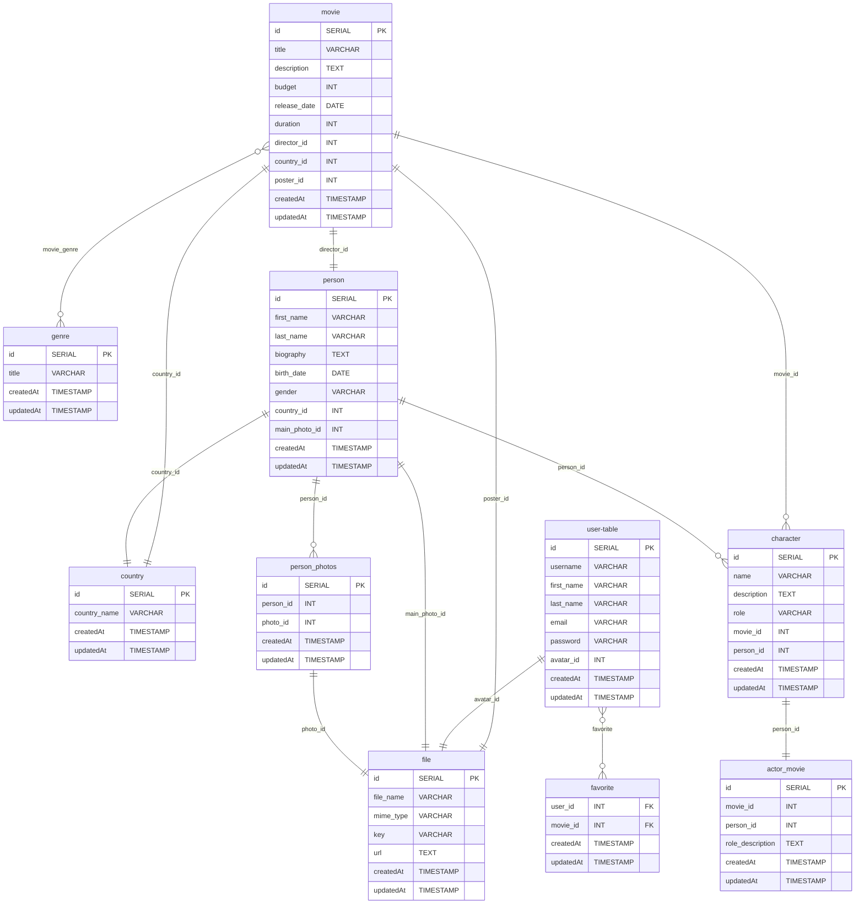

## DB Schema

```mermaid
    erDiagram
    genre {
        id SERIAL PK
        title VARCHAR
        createdAt TIMESTAMP
        updatedAt TIMESTAMP
    }
    file {
        id SERIAL PK
        file_name VARCHAR
        mime_type VARCHAR
        key VARCHAR
        url TEXT
        createdAt TIMESTAMP
        updatedAt TIMESTAMP
    }
    country {
        id SERIAL PK
        country_name VARCHAR
        createdAt TIMESTAMP
        updatedAt TIMESTAMP
    }
    user-table {
        id SERIAL PK
        username VARCHAR
        first_name VARCHAR
        last_name VARCHAR
        email VARCHAR
        password VARCHAR
        avatar_id INT
        createdAt TIMESTAMP
        updatedAt TIMESTAMP
    }  
    person {
        id SERIAL PK
        first_name VARCHAR
        last_name VARCHAR
        biography TEXT
        birth_date DATE
        gender VARCHAR
        country_id INT
        main_photo_id INT
        createdAt TIMESTAMP
        updatedAt TIMESTAMP
    }
    person_photos {
        id SERIAL PK
        person_id INT
        photo_id INT
        createdAt TIMESTAMP
        updatedAt TIMESTAMP
    } 
    movie {
        id SERIAL PK
        title VARCHAR
        description TEXT
        budget INT
        release_date DATE
        duration INT
        director_id INT
        country_id INT
        poster_id INT
        createdAt TIMESTAMP
        updatedAt TIMESTAMP
    }
    actor_movie {
        id SERIAL PK
        movie_id INT
        person_id INT
        role_description TEXT
        createdAt TIMESTAMP
        updatedAt TIMESTAMP
    }
    character {
        id SERIAL PK
        name VARCHAR
        description TEXT
        role VARCHAR
        movie_id INT
        person_id INT
        createdAt TIMESTAMP
        updatedAt TIMESTAMP
    }
    favorite {
        user_id INT FK
        movie_id INT FK
        createdAt TIMESTAMP
        updatedAt TIMESTAMP
    }
    movie }o--o{ genre : movie_genre
    movie || -- || file : poster_id
    movie || -- || country : country_id
    movie || -- || person : director_id
    movie ||--o{ character : movie_id
    person ||--o{ character : person_id

    user-table ||--|| file : avatar_id
    user-table }o--o{ favorite : favorite 

    person ||--|| file : main_photo_id
    person ||--o{ person_photos : person_id
    person_photos ||--|| file : photo_id
    person ||--|| country : country_id
    
    character || -- || actor_movie : person_id
```
